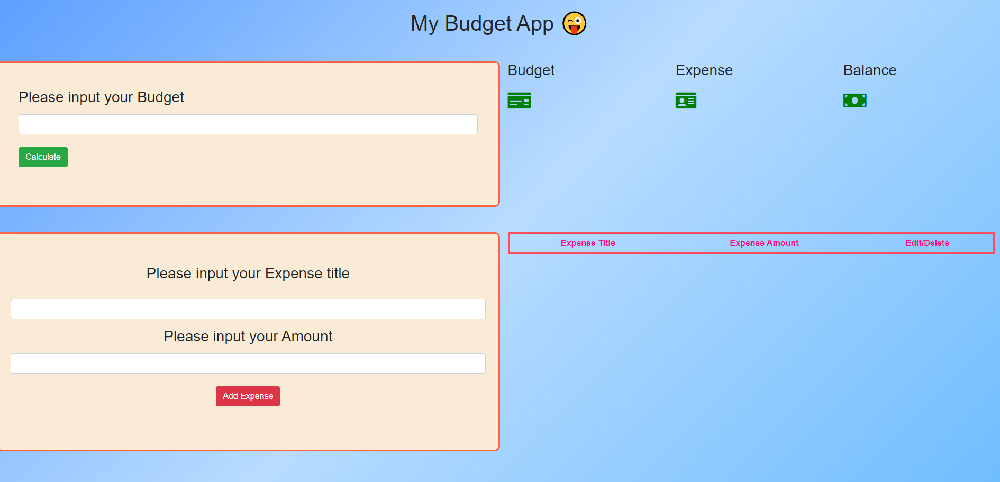

# Budget-expense-js

# This is created Shijing Liu Version 1 2020-10-2

javascript small app (ES6+ bootstrap)

Functions include reminding people input valid number for budget and expense,
calculate balance,
input many items for expense.
Edit and delete each expense.

